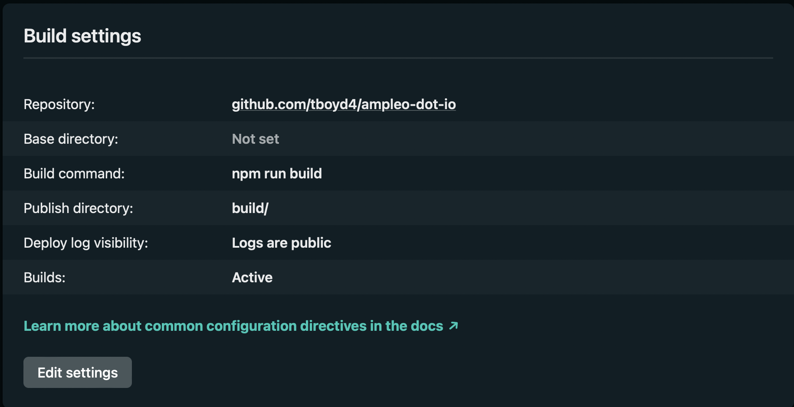
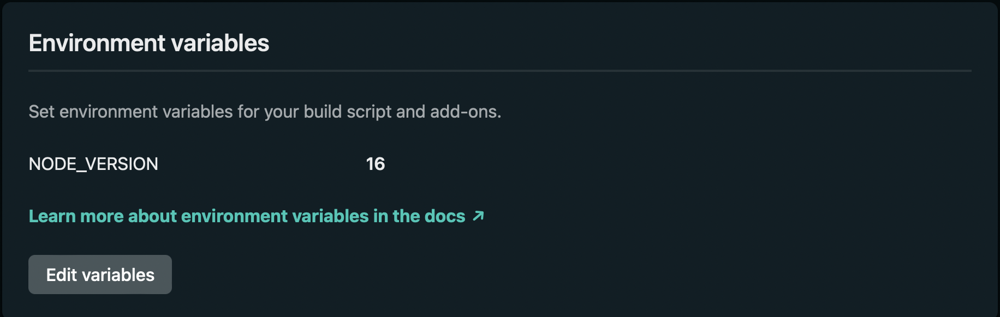

# Crispy SvelteKit Template/Starter Project

## Starter is Configured for the following technologies

- SvelteKit
- TypeScript
- Prettier
- ESLint
- TailWindCSS - Utilizing Just In Time and Purge For Small CSS Files)

## Installation Instructions

- Clone The Repo
- Install The Repo
- Bing Bang Boom, You Gots a Project
- Unless you want a lot of frustration, make sure you are using node version 14.13.1
- I promise, no other node version will do. Go download NVM and use 14.13.1

### Important Documentation

- [TailWindCSS](https://tailwindcss.com/docs)
- [SvelteKit](https://kit.svelte.dev/docs)
- [Svelte](https://svelte.dev/docs)
- [TypeScript](https://www.typescriptlang.org/docs/)

### Netlify Deploy and Build Settings

